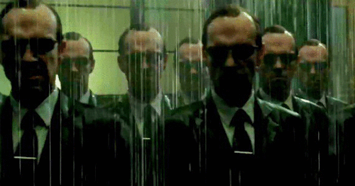

I originally wanted to start this series with **context and context
engineering**.

But then I realized that before talking about how to work with agents, we should
probably make sure that when we say _agent_, we all mean roughly the same thing.

So, let's start there.

## Agents. Agents everywhere.

Agents are everywhere nowadays. And they are pretty powerful.

They look like magic. They smell like magic. Sometimes the things they do
definitely **feel like magic**.

But actually, agents themselves are not magic.

If there is any magic involved, it's mostly happening inside the **model** behind
them.

An agent is, very simplified, a system built **around a model** to help it
achieve a certain goal.

It gives the model instructions about what it's supposed to do, provides it with
tools it can use, and has some logic around it that allows the model to
repeatedly decide:

**What should I do next?**

Use a tool. Look at the result. Decide what to do next. Use another tool. Look at
that result. Change direction if necessary. Repeat.

Until hopefully...

**job done.**

Of course, the reality is more complicated than that, but as a mental model, this
should do the trick.

## Not all agents wear the same suit

There are many different kinds of agents, built for different purposes.

Even the familiar ChatGPT is an agentic system around a model. Depending on the
task and available capabilities, it can do more than just generate an answer: it
can search for information, work with files, use tools, reason about their
results and take multiple steps towards a goal.

And then there are **coding agents**.

Coding agents are specialized for one particular world: **software development**.

You give them a coding problem, and they have tools that help them solve it.

They can inspect our codebase.

Search for things.

Read and edit files.

Run commands.

Compile the project.

Run tests.

Look at what happened.

Realize their brilliant solution wasn't actually that brilliant.

Change it.

Run the tests again.

And continue this loop until they believe they've solved the problem.

So if we strip away all the fancy terminology, a useful simplified picture of a
coding agent is something like:

**Model + Instructions + Tools + Agentic loop → Coding Agent**

That's basically the creature we're working with when we use something like
Claude Code.

Is this the complete technical definition of an agent?

Absolutely not.

But I think it's enough of a mental model for what we're going to talk about
next.

## So... where's the magic?

Unfortunately, coding agents aren't magic.

But with the right conditions, they can certainly **feel like it**.

And if we want to keep them smart — instead of watching them slowly become
confused, forget things, or start doing stupid stuff — we need to understand one
of the most important things they work with:

**context.**

And that's where we're going next.

Tamas
