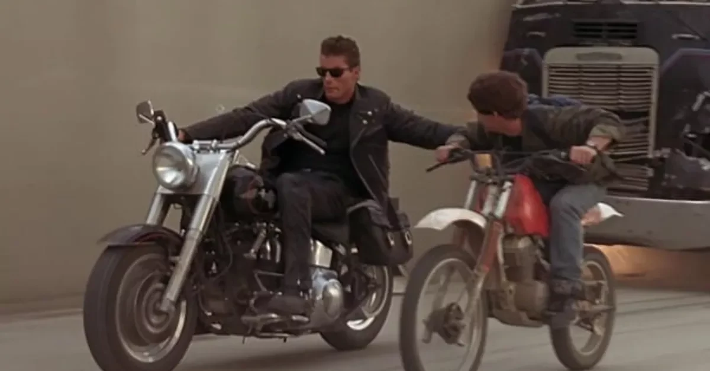

Hello everyone!

I'd like to start something new today.

I definitely won't surprise you if I say that lately, everything is about AI and
coding agents in the land of software development.

We at andromeda already use them too — some of us more, some of us not that much
yet. But they're definitely here, so we'd better learn to work with them.

As everybody is always busy with daily work, and meetings often get postponed
because of urgent stories and tasks, I thought I'd try something new — something
asynchronous.

## What this is

What I'm starting now is a kind of letter/article format where I'll address one
topic at a time related to working with coding agents. I'm going to share my
knowledge and my own experiences working with these robots, which I'm sure some
of you will find useful and applicable in your daily work.

But I don't want this to be one-sided. I really hope these messages will trigger
some conversations, that you'll share your experiences too, and that we'll even
come up with new ideas together that can help us up our game as a team.

To make this an easy and sustainable habit for everyone, I'll try to keep these
messages really short — something like a 3–4 minute read, bite-sized. At the
beginning, there will probably be a few messages per week, but over time,
probably fewer.

I'm open to feedback anytime — both in general and about topics you'd like to see
covered.

## What's coming

I already have some ideas about which topics to cover, but the list is definitely
not complete. Over the next few weeks, I'll share things about context
management, memory files, skills, commands, workflows, probably MCPs, and who
knows what else.

Considering the pace of change in this world, it may even happen that something
on this list is already outdated by the time we get there. :)

It's gonna be great — stay tuned!

The first topic will be **context**, and it's coming really soon.

Tamas
