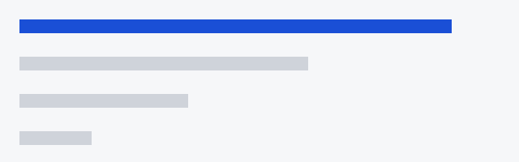

Everything a coding agent knows about your task at the moment it acts is its
**context**: the prompt, the files it has read, the tool output it has seen, and
whatever the harness injected on your behalf.

## What ends up in there

- the system prompt and any project instructions
- the conversation so far, including your corrections
- file contents the agent read, and command output it ran
- retrieved snippets from search or documentation

> Context is not memory. It is the working set the model reasons over right now,
> and everything outside it effectively does not exist.



## Why it matters

An agent that produces a wrong answer is often not reasoning badly — it is
reasoning correctly over the wrong working set. Before blaming the model, check
what it could actually see:

```bash
# What did the agent read before it made that change?
git diff --stat
```

The rest of this series looks at how that working set degrades, and what to do
about it.
