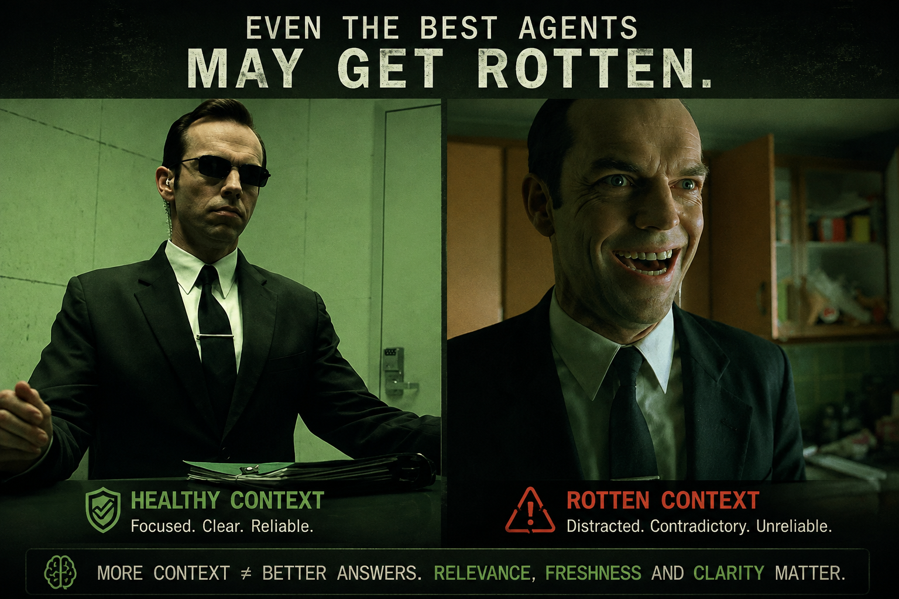

Have you ever asked someone a really simple question like:

> **“What time are we leaving?”**

And instead of _“around 6”_, you get:

> “Well, originally I thought 5, but then I remembered that yesterday Peter said
> the traffic gets pretty bad around that time, which actually reminded me that
> last time we went there we took the other road, because there was construction
> near the bridge — you know, the bridge where we stopped that time when...”

Five minutes later, you know **everything except what time you're leaving.**

Maybe the answer was even in there somewhere.

It was just buried under so much other information that extracting the thing you
actually cared about became surprisingly difficult.

To be fair, I've been on **both sides** of conversations like this. :)

And here's the interesting part:

**We do exactly the same thing to our coding agents.**

## Our very smart agent starts getting... less smart

Remember [the context bucket](../context-is-everything-whats-in-the-box/) from
last time?

As we work, we keep throwing things into it:

conversations, code, search results, test outputs, logs, failed approaches, old
decisions, new decisions, more code...

Most of this information isn't necessarily _wrong_.

But there's increasingly more stuff the model has to work through to figure out
what actually matters **right now**.

And eventually you may notice something strange.

The agent that seemed super smart at the beginning of the session starts
becoming...

well...

**a little less smart.**

Welcome to **context rot**.

![Context rot is not just about size: three buckets side by side. A healthy context holds only system instructions, memory, your messages, agent responses, code and tool results, with plenty of room to think. A drifting one has filled up with earlier conversations, older files and repeated tool results — still usable, but you may notice repetition and mix-ups. A rotten one is full to the rim with dead ends, rejected approaches, contradicting decisions and stale outputs, leaving very little room and making it easy to get lost](./images/context-rot.png)

There's one important thing about this picture, though:

**Context rot isn't simply “the bucket is 80% full, Claude is dumb now.”**

Size matters — even for our shiny new supermodels. :)

But there isn't some magical threshold where everything suddenly goes from:

🧠 **GENIUS**

to

🥔 **POTATO**

It's usually much more gradual than that.

And the amount of context is only part of the story.

## So why does context rot happen?

There are several things working against us.

### ⚔️ Contradictions accumulate

Earlier you said we should use approach A.

Twenty minutes later, after investigating, you decided approach B is better.

Both pieces of information may still be somewhere in the conversation.

The model now has to understand which one actually represents the current truth.

Do this enough times and our nice clean context starts becoming a history book.

### 🕰️ Information becomes stale

Tool outputs, logs, code snippets and assumptions that were useful 30 minutes ago
might no longer describe the current state of the code.

But they're still part of the history.

### 🔍 Important things get buried

The information Claude needs might actually be there — just buried among
thousands of other tokens.

Long-context models are impressive, but finding and correctly using the right
detail from a huge amount of competing information is not free.

A useful way to think about it is our conversation from the beginning:

**The answer might be there. It's just getting harder to find.**

### 🎯 Attention gets spread thin

Under the hood, the model has to decide which parts of the available context
matter for what it's doing now.

The more information we throw in — relevant, irrelevant, outdated, contradictory
— the more signals are competing for attention.

In other words:

**more tokens don't automatically mean more knowledge.**

Sometimes they just mean **more noise**.

## How do I know my context is going bad?

You usually don't need a fancy metric.

**You'll feel it.**

Claude starts doing things that make you stare at the terminal for a second:

❌ Forgets the file you literally just edited.

❌ Re-suggests a fix you already rejected three turns ago.

❌ Mixes up two different functions with similar names.

❌ Goes in circles — same plan, slightly different wording.

❌ Starts referring to functions, imports or APIs that don't actually exist.

One of these doesn't automatically mean _“context rot!”_

But when a session has been running for a while and several of these start
appearing...

your context might be trying to tell you something.

So what do we do about it?

Throw everything away?

Start over?

Compact it?

And what the hell does _compact_ actually do?

That's exactly what we'll look at next:

**Context hygiene.**

Tamas
