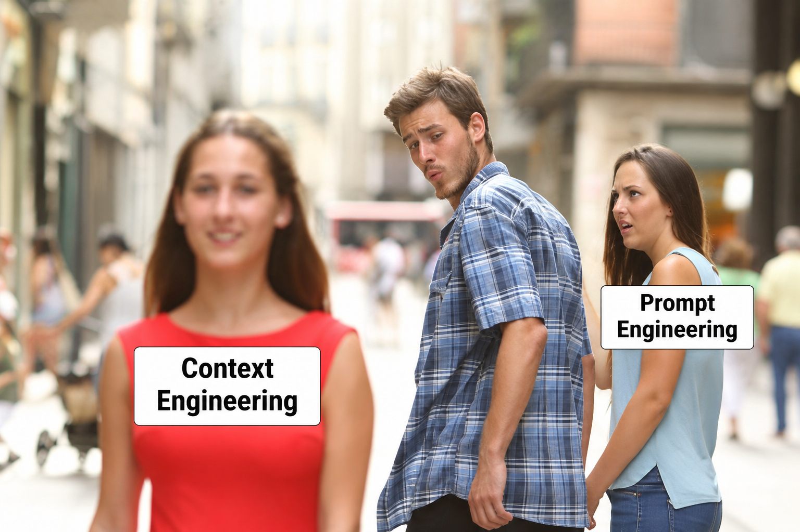

For quite a while, **prompt engineering** was everywhere.

You had to write the perfect prompt. Be super precise. Structure it correctly.
Give the model exactly the right instructions if you wanted a clever answer.

That's still true to some extent — a good prompt is definitely better than a bad
one.

But models got better. Much better.

They can understand us even when our prompts are a bit more... human. They can
deal with incomplete instructions, ask questions, investigate things and figure
out quite a lot themselves.

And with the rise of agents, something else has moved more and more into focus:

**Context is the new prompt.**

## Why does it matter?

This might all feel a bit theoretical so far.

Nice mental model — but where's the practical part?

Here's the thing: in the end, what we actually care about is **the code that
comes out**.

And the quality, correctness and completeness of that code depend heavily on the
context it was written in.

Good context tends to mean good code: correct, complete, and looking like it
belongs in the project.

Bad context tends to mean the opposite — strange solutions, code that ignores
what's already there, missing pieces, and sometimes plain bugs.

So context isn't just an interesting detail about how these models work.

It's one of the main things standing between us and the code we actually wanted.

## So, what is context?

When you start Claude Code — whether in your terminal or through your IDE — you
start a session.

From the outside, it looks pretty simple:

**You → Claude → You → Claude → You → Claude**

And you might think that's your context: the conversation you see on the screen.

But there's actually **a lot more going on behind the scenes**.

The model needs information to know who it is, what it's supposed to do, what
you've asked for, what it has already discovered, and what has happened so far.

So its context can contain things like:

- system instructions telling the model how the agent should behave
- project and memory instructions
- your messages
- previous responses
- code and files the agent has read
- results from searches and commands
- test output, compiler errors, Git diffs...
- and other information gathered while working on the task

Some of this you see.

A lot of it you don't.

## One question can already mean a lot of context

Let's say you give Claude a coding task.

Claude doesn't necessarily immediately know the answer.

First, the model might decide:

> _I need to understand how this service works._

So the agent searches the project and reads a few files.

Now the model has more information.

Based on that, it might decide:

> _Okay, I think I found the problem. Let's change this and run the tests._

The agent edits the code and runs the tests.

The test output gives the model **even more information**.

Maybe something fails.

So it investigates another file.

Gets another result.

Changes something else.

Runs another command.

And this loop can continue for quite a few rounds before you finally see:

> _Done. I've implemented the change and all tests pass._

From our side, that might look like **one request → one answer**.

Under the hood, quite a lot may have happened.

## And that was only one task...

Of course, we don't close Claude after every single interaction.

We continue.

We ask another question.

Claude investigates something else.

More conversation.

More code.

More tool results.

Then another task.

More conversation. More files. More results.

And again.

And again.

The information available in the session **starts piling up**.

_A small disclaimer: the bucket in this picture is smaller than it really is.
Modern models have a lot more room in there. But information piling up can become
a problem well before the bucket is actually full._

And **that** is the important mental model I wanted to establish today.

The model isn't working only with the prompt you just typed.

It's working with a whole bunch of information that has accumulated around the
current task and session.

Managing that information — **managing the context** — is one of the most
important parts of keeping our agents smart.

So now we know what context is and how it grows.

Next time, we'll look at what happens when **too much stuff starts piling up in
there**.

Spoiler: more context doesn't necessarily mean a smarter agent. :)

Tamas
